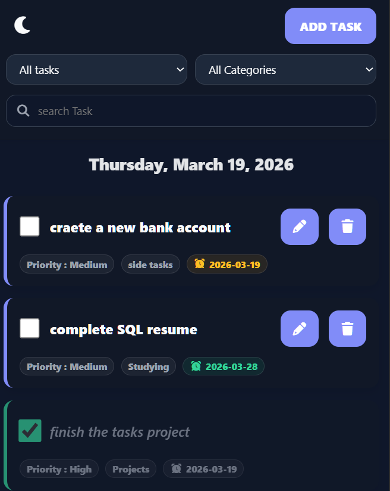
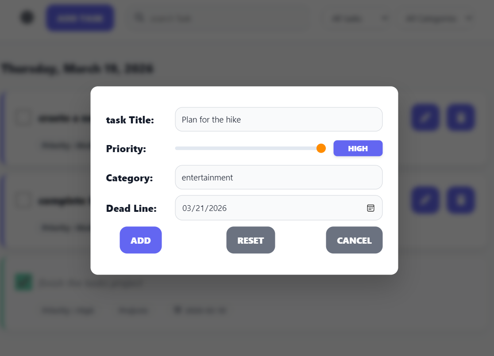

>Live Demo : https://yusef-mk.github.io/shiny-tasks/

>Shiny Tasks Screenshots :  
Screenshot 1

Screenshot 2

>Web Project : Habit Loop

A high-performance Task Management Dashboard designed for  users to keep tasks structured. This application moves beyond simple lists, offering real-time filtering, category management, and deadline tracking with persistent storage.

>Features included :

1-Dynamic Dashboard: View, search, and filter tasks by completion status or custom categories in real-time.  
2-Intelligent Sorting: Tasks are automatically prioritized by:
Completion Status (Pending tasks first),
Deadline (Closest dates first),
Priority Level (High to Low).    
3-Smart Deadlines: Visual indicators for tasks that are Overdue, Due Today, or have Time Remaining.  
4-Modals: Uses the native <dialog> API for a clean, non-intrusive CRUD (Create, Read, Update, Delete) experience.  
5-Theme Engine: Full Dark Mode support with persistence using localStorage.  
6-Automated Categorization: Dynamically builds a category filter based on your existing tasks.  

>Tech Stack :
 
-HTML5   
-CSS3   
-JavaScript (ES6+)   

>Project Structure :

.  
├── index.html   
├── README.md       
├── js/  
│   └── script.js   
├── css/  
│   └── style.css  
└── assets/  

>Technical Challenges Overcome :

1-Instead of a list of categories, I built a system that learns from the user. I used a Set to extract unique category names from the tasks array, which then dynamically populates both the filter dropdown and the datalist for the input field. This ensures that the UI stays perfectly in sync with the data without any manual overhead.   
2-To make the list feel intuitive, I had to move beyond simple alphabetical sorting. I developed a custom comparator that evaluates tasks based on three levels of urgency:
Status: Pending tasks at the top.
Deadline: Tasks are then ordered by the closest date.
Priority: Finally, tasks with the same deadline are sorted by their "High/Medium/Low" priority .   
3-the tricky part was the validation during the Edit vs. Create states.  
I had to ensure that:
Duplicates: The app prevents creating two tasks with the same name.
Context: When editing, the validation must ignore the task's own current name but still block names used by other tasks.
Date Safety: I implemented logic to prevent setting deadlines in the past relative to the current day.  

>03-2026 Youssef .MK
